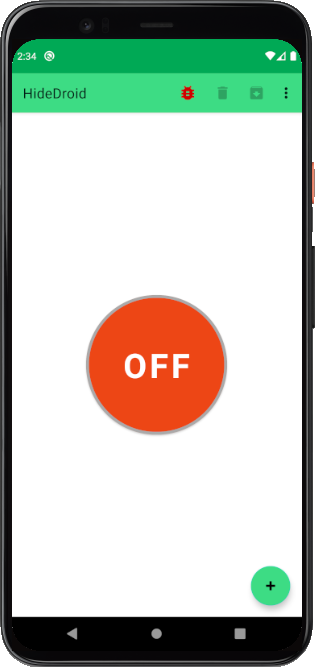
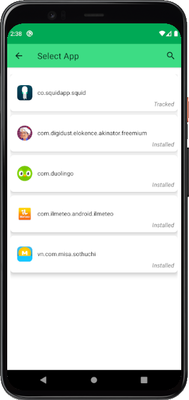
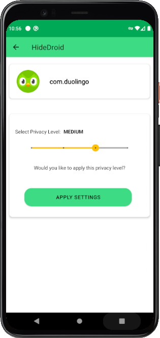
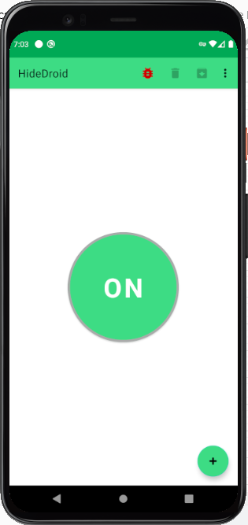

# HideDroid 
> An Android App for preserving user privacy 

**HideDroid** is an Android app that allows the per-app anonymization of collected personal data according to a privacy level chosen by the user.

In a nutshell,**HideDroid** collects all the network traffic generated by the invocation of API calls belonging to analytics libraries, and extract the exported data.

Then, it anonymizes the personal and device data using a generalization technique, and the data related to the user’s behavior using an approach based on the concept of local differential privacy, in a way that preserves as much data semantics as possible.

Finally, the anonymized data are sent to the expected recipients by mimicking the original network calls.

## ❱ Publication

More details about **HideDroid** can be found in the paper [titolo](link).

We submit it for consideration to [IEEE TDSC journal](https://ieeexplore.ieee.org/xpl/RecentIssue.jsp?punumber=8858).

## ❱ Screenshot

## ❱ Contributing

Questions, bug reports and pull requests are welcome on GitHub at [https://github.com/Mobile-IoT-Security-Lab/HideDroid](https://github.com/Mobile-IoT-Security-Lab/motan).

## ❱ License

This tool is available under a dual license: a commercial one required for closed source projects or commercial projects, and an AGPL license for open-source projects.

Depending on your needs, you must choose one of them and follow its policies. A detail of the policies and agreements for each license type is available in the [LICENSE.COMMERCIAL](LICENSE.COMMERCIAL) and [LICENSE](LICENSE) files.

## ❱ Credits

This software was developed for research purposes at the Computer Security Lab ([CSecLab](https://csec.it/)), hosted at DIBRIS, University of Genoa.

## ❱ Team

* [Davide Caputo](https://csec.it/people/davide_caputo/) - Ph.D Student & Developer
* [Francesco Pagano](https://github.com/X3no21) - Post-Graduate Research Fellow & Developer
* [Giovanni Bottino](https://github.com/GiovanniBottino) - Developer
* [Gabriel Claudiu Georgiu](https://github.com/ClaudiuGeorgiu) - Developer
* [Luca Verderame](https://csec.it/people/alessio_merlo/) - Postdoctoral Researcher
* [Alessio Merlo](https://csec.it/people/alessio_merlo/) - Faculty Member